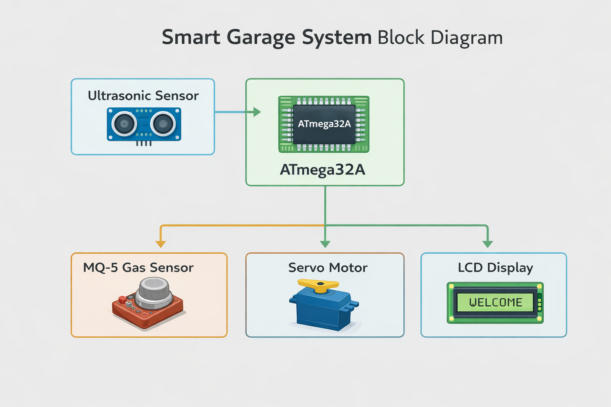
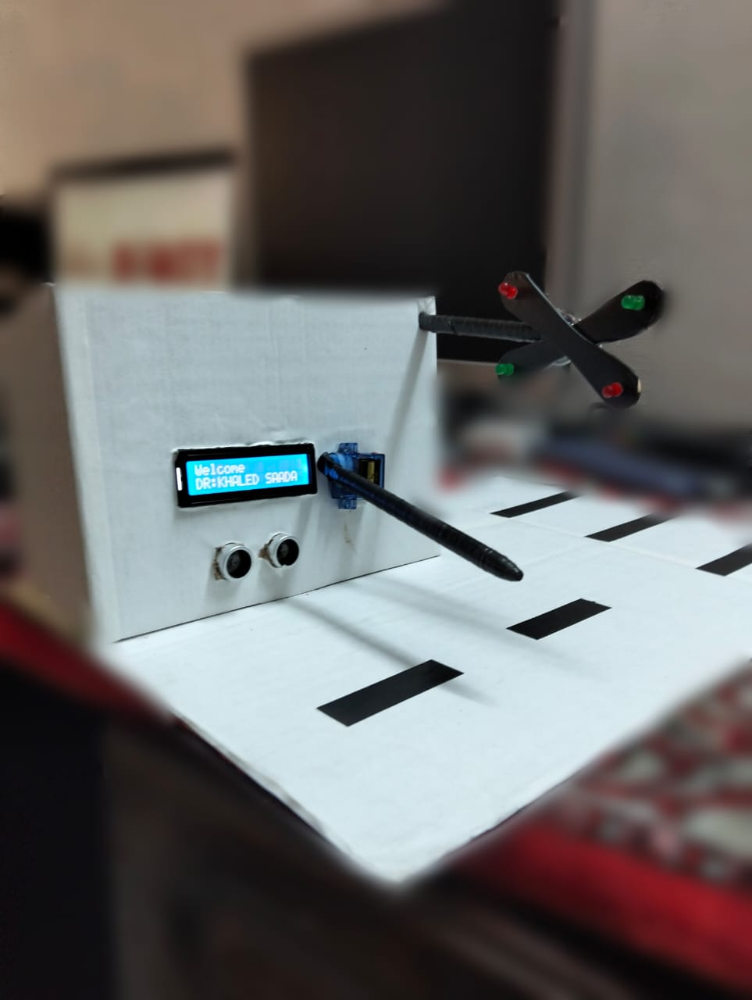
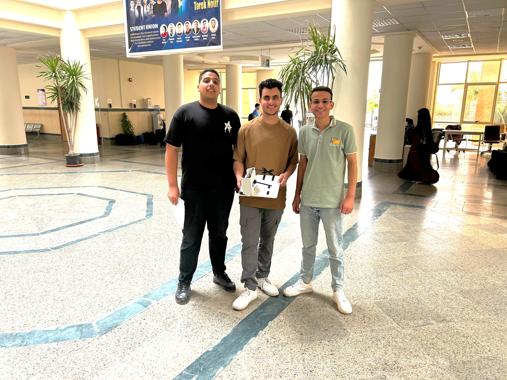
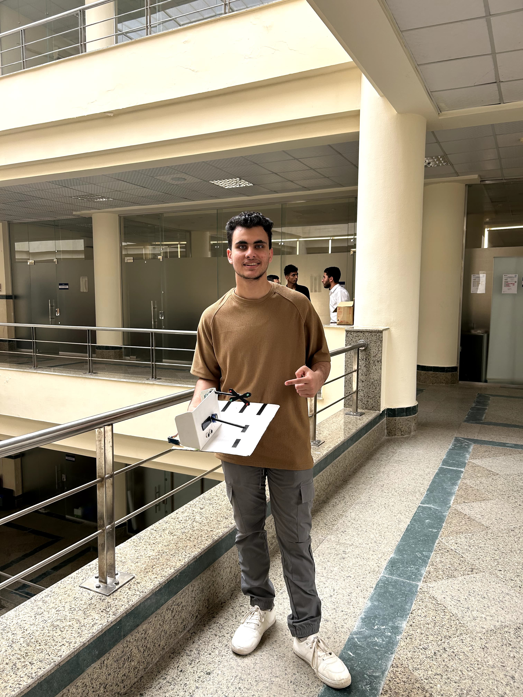
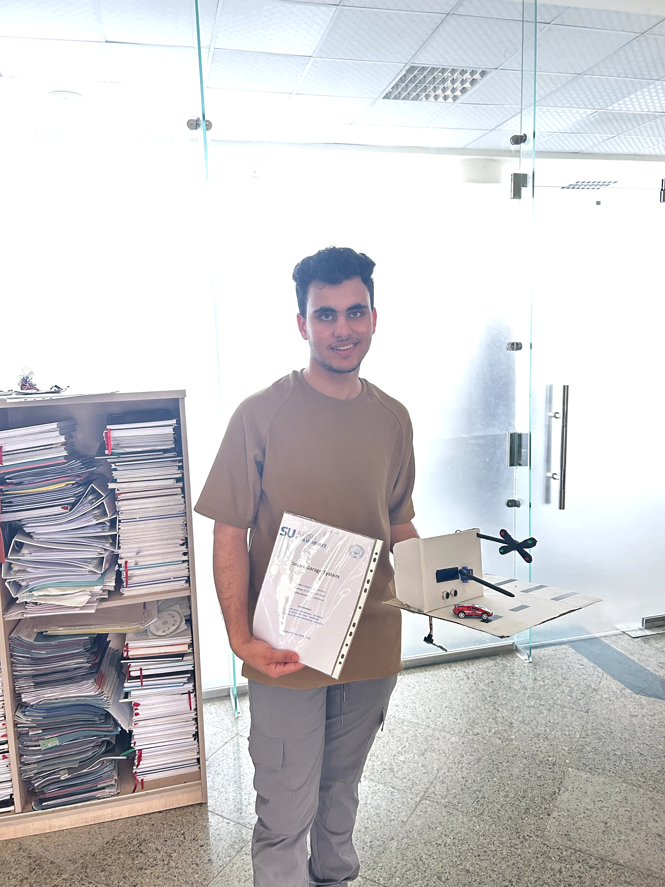

# 🚗 Smart Garage System
### Computer Architecture Project (2024–2025)

An embedded system that automates a garage gate using ATmega32A, with vehicle detection and gas safety monitoring.

---

## 📚 Course Information
- **Course:** Computer Architecture  
- **Supervisor:** Dr. Khaled Samir Saada  
- **Teaching Assistant:** Zahra Mahmoud  

---

## 👥 Team Members
- Amin Ahmed Abdelmoaty — 202302585  
- Ahmed Sami Fathi — 202302442  
- Mostafa Mohamed Abdelshafy — 202302421  

---

# 📌 Project Overview

The Smart Garage System is a small-scale embedded automation project built using the **ATmega32A microcontroller**.

The system:
- Detects approaching vehicles using an Ultrasonic Sensor.
- Monitors gas leaks using an MQ-5 Gas Sensor.
- Automatically opens and closes the garage gate using a Servo Motor.
- Displays system status using a 1602A LCD.

---

# 🏗️ System Architecture

## 🔷 Block Diagram



---

# 🔧 Hardware Implementation



---

# 👨‍💻 Team & Presentation

## 👥 Team Members



## 🧑‍💻 Amin with the Project



## 🎤 Final Presentation Day


---

# 🏆 Awards & Recognition




---

# 🔩 Hardware Components

## 1️⃣ ATmega32A Microcontroller

### Specifications:
- 8-bit AVR Architecture
- 32KB Flash Memory
- 1KB SRAM
- 1KB EEPROM
- 32 I/O Pins
- 10-bit ADC (8 Channels)
- Up to 16 MHz Clock

---

## 2️⃣ Ultrasonic Sensor (HC-SR04)

### Specifications:
- Operating Voltage: 5V
- Range: 2cm – 400cm
- Accuracy: ±3mm

Working Formula:
Distance = (Time × Speed of Sound) / 2

---

## 3️⃣ MQ-5 Gas Sensor

### Specifications:
- Operating Voltage: 5V
- Detection Range: 200–10,000 ppm
- Output: Analog Voltage
- Warm-up Time: ~20 seconds

---

## 4️⃣ Servo Motor

### Specifications:
- Operating Voltage: 4.8V – 6V
- Rotation Range: 0°–180°
- Control Method: PWM

---

## 5️⃣ LCD 1602A Display (8-bit Mode)

### Features:
- 16x2 Characters
- 5V Operation
- Parallel 8-bit Interface

---

# 🔁 System Workflow

1. Initialize system  
2. Warm up gas sensor  
3. Continuously monitor gas levels  
4. Measure distance  
5. If distance < threshold AND gas safe → Open gate  
6. Wait predefined delay  
7. Close gate  
8. Repeat loop  

---

# 💻 Software Design

- Programming Language: C (AVR-GCC)
- ADC Configuration
- PWM via Timer
- Polling-based ultrasonic reading
- Safety logic implementation

---

# 📂 Repository Structure

```bash
Smart-Garage-System/
│
├── code/
│   └── main.c
│
├── images/
│   ├── block_diagram.png
│   ├── project_hardware.jpg
│   ├── team_photo.jpg
│   ├── amin_with_project.jpg
│   ├── final_presentation.jpg
│   ├── award_ceremony_1.jpg
│   ├── award_ceremony_2.jpg
│   └── award_ceremony_3.jpg
│
└── README.md
```
---

# 🔗 Full Project Post on LinkedIn

Want to see the full project story, presentation highlights, and final moments?

<div align="center">

### 🚀 View the Complete Project Post

[](https://www.linkedin.com/posts/aminah7med_our-project-moments-ugcPost-7328049185646108673-Ve27?utm_source=share&utm_medium=member_desktop&rcm=ACoAAFE6PugBStMzhZMKNtlqLtrt7cDV7tqiSsU)

</div>

---

---

# 📜 License

Academic project — Faculty of Information Technology & Computer Science(2024–2025)
